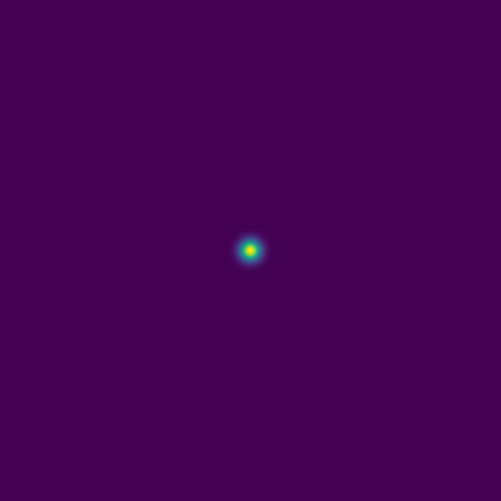
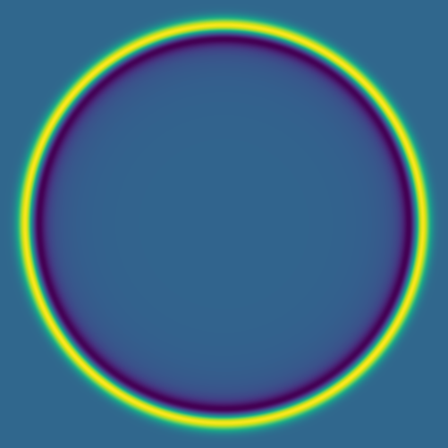
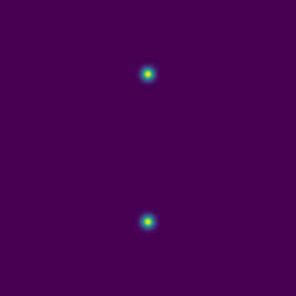
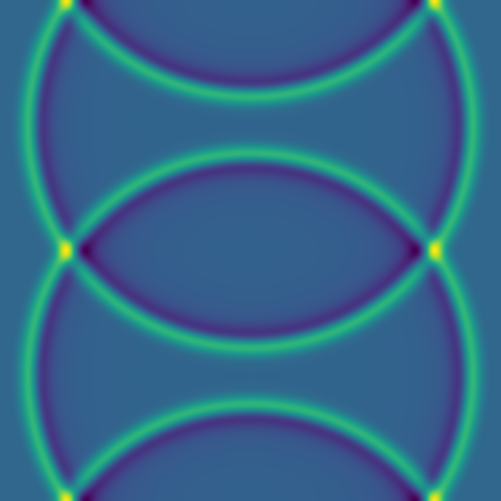
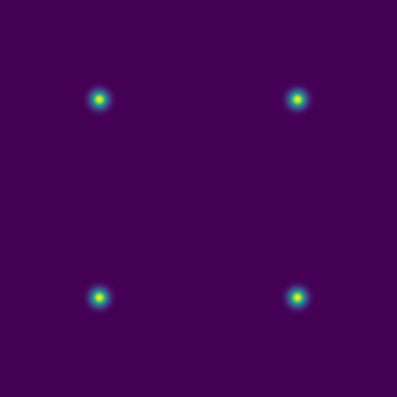
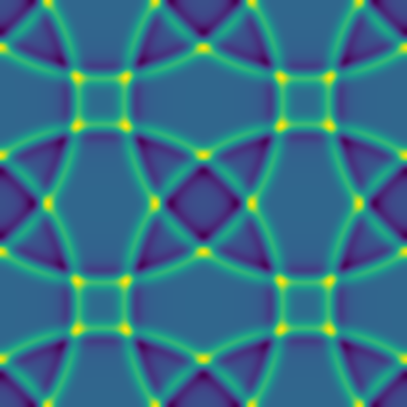
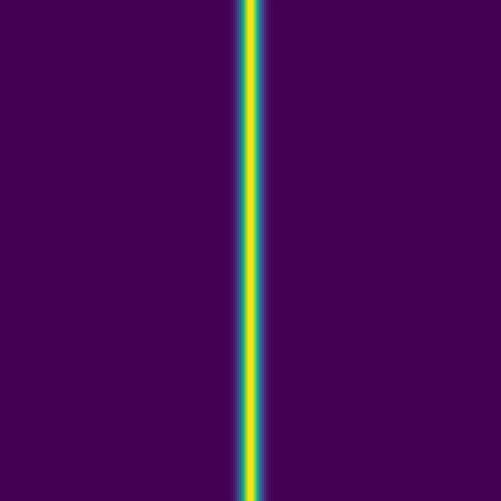
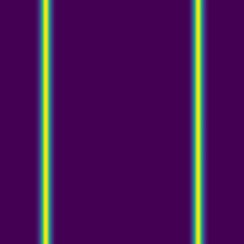
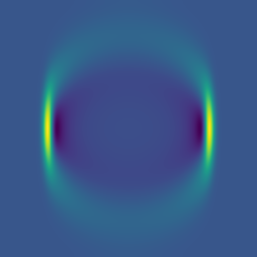
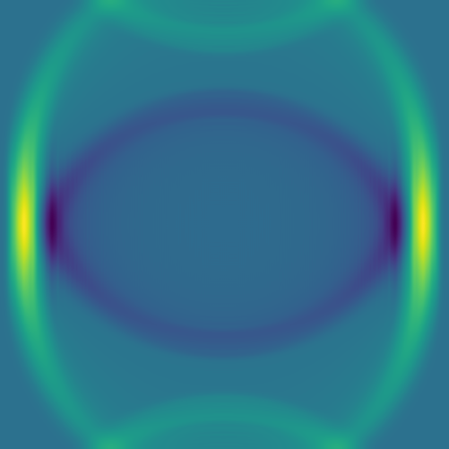

**May 07<sup>th</sup>, 10:00am–12:00pm Pacific Time**

**Abstract**: Most machine learning courses focus on standard workflows -- such as image classification --
where many pre-trained community models are readily available (e.g., via Hugging Face). In this course, we
take a different approach by building a model for a custom scientific task: predicting the solution of a
partial differential equation (PDE) from a given initial condition. The goal is to train a neural network that
acts as a fast surrogate for traditional numerical solvers.

Using JAX, Flax, and Optax, we will train a surrogate model on 2D simulation data that we generate
ourselves. Along the way, we will develop a complete machine learning pipeline from scratch: generating
synthetic training data via simulations, selecting the right model architecture, training the model on an HPC
cluster, making sure it runs efficiently on cluster's GPUs, and evaluating the quality of the surrogate
solutions.

We will explore three increasingly challenging types of initial conditions: a single Gaussian peak placed
randomly within the domain, multiple random Gaussian peaks, and a combination of Gaussian peaks with 1D linear
Gaussian features.

This course builds on our earlier [JAX course](https://mint.westdri.ca/ai/top_fl), but no prior experience is
required, as we will start from the basics.

## Disclaimer

I am not an AI/ML specialist, but with a background in numerical methods and fluid dynamics, I am interested
in building a surrogate model that can generate solutions after being trained on a set of PDE
simulations. Most ML courses I've come across focus either on theory or on very different applications, such
as image classification, so I decided to build a workflow around this specific use case. I hope that
demonstrating how to train a neural network on simulation data will be useful to others.

Since I am relatively new to working directly with ML frameworks, I would really value your feedback. I also
want the course to be transparent about the process, showing not only what works, but also what doesn't when
tackling this kind of problem. <!-- Could CNNs or U-Nets solver this problem efficiently? -->

Going forward, we plan to offer a series of hands-on courses covering different types of ML problems, all
focused on developing models from scratch.

## Installation

If running on your own computer, you will need a GPU for training. For inference, a CPU is sufficient. In
either case, you would install the following libraries:

```sh
uv venv ~/env-jax --python 3.12   # create a new virtual environment
source ~/env-jax/bin/activate
uv pip install jax flax pillow matplotlib
...
deactivate
```

Here is the installation on a production cluster (e.g. Fir):

```sh
module load python/3.12.4
python -m venv ~/env-jax
source ~/env-jax/bin/activate
python -m pip install --upgrade --no-index pip
python -m pip install --no-index jax flax pillow matplotlib
python -m pip install --no-index jax[cuda]          # installs jax-cuda12-pjrt, jax-cuda12-plugin
# avail_wheels --name "*pytorch*" --all_versions    # check out the available packages
# python -m pip install --no-index gpytorch==1.13   # if needed, install a specific version
...
deactivate
```

Today we'll be using our training cluster where we have already installed everything into a dedicated virtual
Python environment. To load it:

<!-- git clone git@github.com:razoumov/simdata.git jax -->

```sh
source /project/def-sponsor00/shared/fixModules.sh
source /project/def-sponsor00/shared/env-jax/bin/activate
```

::: {.callout-note}
When training on our small cluster, for some bigger models we'll have to reduce the batch size by 2X
(`batchSize=4`) to fit them into the 2g.10gb's memory.
:::

Now, we'll log in to the training cluster with your username and password.


## Numerical problem

<!-- I am solving numerically a 2D PDE problem. Each solution has two images: an initial condition and an -->
<!-- associated solution. Give me a JAX code to train a generative AI model to predict solutions based on the -->
<!-- initial conditions. Use NNX neural network library. In other words, I would like to do GPU-accelerated machine -->
<!-- learning to train surrogate models from simulation results. Please walk me through the entire process. I am -->
<!-- reading input data with the following code: -->

The goal of this 2-hour ML course is to train a generative AI model on an ensemble of solutions from a 2D
advection solver, and then use the model to predict solutions based on initial conditions.

<!-- I am using a Chapel code to generate the solutions for model training. -->

Consider the following acoustic wave equation with $c=1$ (speed of sound), written as a system separately for
velocity and pressure:

$$
\begin{cases}
   \partial\vec{v}/\partial t = -\nabla p\\\
   \partial p/\partial t = -\nabla\cdot\vec{v}
\end{cases}
$$

Writing a full 3D solver is straightforward, but to reduce the model training time, we will implement it in
2D. Here is a multi-threaded implementation of this solver in Chapel `acoustic2D.chpl`:

```{.c .chpl}
use Image, Math, IO, sciplot, Time;
use Random;
config const n = 500, nt = 250, nout = 250; // resolution, max time steps, plotting frequency
const a = 0.1;   // 0.1 - thick front, no post-wave oscillations; 0.5 - narrow front, large oscillations
config const animation = true;
config const model = 8, nruns = 1;

var h = 1.0 / (n-1), coef = -(a/h)**2;

var colour: [1..n, 1..n] 3*int;
var cmap = readColourmap('viridis.csv');   // cmap.domain is {1..256, 1..3}

const mesh = {1..n, 1..n};
const largerMesh = {0..n+1, 0..n+1};
var Vx, Vy, P, tmp: [largerMesh] real;

var watch: stopwatch;
watch.start();
for run in 1..nruns {
  P = 0;
  Vx = 0;
  Vy = 0;
  select model {
    when 8 do {
      // 1-5 randomly placed points
      var rint = new randomStream(int);
      var np = rint.next(min=1, max=5);   // default max=5
      var rreal = new randomStream(real);
      var sources: [1..np] (real, real);
      for i in 1..np do
        sources[i] = (0.2 + 0.6*rreal.next(), 0.2 + 0.6*rreal.next());
      for (i,j) in mesh {
        P[i,j] = 0;
        for src in sources do
          P[i,j] += exp(coef*( ((i-1)*h-src[0])**2 + ((j-1)*h-src[1])**2 ));
      }
    }
    when 9 do {
      // two randomly placed points with a line between them
      var rreal = new randomStream(real);
      var points = [(0.2+0.6*rreal.next(), 0.2+0.6*rreal.next()),
                    (0.2+0.6*rreal.next(), 0.2+0.6*rreal.next())];
      var ax = points[1][0] - points[0][0], ay = points[1][1] - points[0][1];
      for (i,j) in mesh {
        var wx = (i-1)*h - points[0][0], wy = (j-1)*h - points[0][1];
        var alength = sqrt(ax*ax + ay*ay), wlength = sqrt(wx*wx + wy*wy);
        var distanceFromTheLine = abs(ax*wy - ay*wx) / alength;
        var dimensionlessCoordinateAlongTheLine = (ax*wx + ay*wy) / (alength*alength);
        if dimensionlessCoordinateAlongTheLine > 1 then
          P[i,j] = exp(coef*(((i-1)*h-points[1][0])**2+((j-1)*h-points[1][1])**2));
        else if dimensionlessCoordinateAlongTheLine < 0 then
          P[i,j] = exp(coef*(((i-1)*h-points[0][0])**2+((j-1)*h-points[0][1])**2));
        else
          P[i,j] = exp(coef*distanceFromTheLine**2);
      }
    }
  }

  if animation then plotPressure(0,run);

  var dt = h / 1.6;
  for step in 1..nt {
    periodic(P);
    periodic(Vx);
    periodic(Vy);
    forall (i,j) in mesh {
      Vx[i,j] -= dt * (P[i,j]-P[i-1,j]) / h;
      Vy[i,j] -= dt * (P[i,j]-P[i,j-1]) / h;
    }
    forall (i,j) in mesh do
      P[i,j] -= dt * (Vx[i+1,j] - Vx[i,j] + Vy[i,j+1] - Vy[i,j]) / h;
    if step%nout == 0 && animation then plotPressure(step/nout,run);
  }
}
watch.stop();
writeln('Simulation took ', watch.elapsed(), ' seconds');

proc periodic(A) {
  A[0,1..n] = A[n,1..n]; A[n+1,1..n] = A[1,1..n];
  A[1..n,0] = A[1..n,n]; A[1..n,n+1] = A[1..n,1];
}

proc fourDigits(n: int) {
  var digits: string;
  if n >= 1000 then digits = n:string;
  else if n >= 100 then digits = "0"+n:string;
  else if n >= 10 then digits = "00"+n:string;
  else digits = "000"+n:string;
  return digits;
}

proc plotPressure(step,run) {
  // var output: [largerMesh] real;
  var output = P;
  for (i,j) in output.domain {
    if output[i,j] < 0.0 then output[i,j] = 0.0;
    //if output[i,j] > 0.10 then output[i,j] = 1.0;
  }
  var smin = min reduce(output);
  var smax = max reduce(output);
  writeln(smin, "  ", smax);
  for i in 1..n {
    for j in 1..n {
      var idx = ((output[j,n-i+1]-smin)/(smax-smin)*255):int + 1; //scale to 1..256
      colour[i,j] = ((cmap[idx,1]*255):int, (cmap[idx,2]*255):int, (cmap[idx,3]*255):int);
    }
  }
  var pixels = colorToPixel(colour);   // array of pixels
  var filename = "frame" + model:string + fourDigits(run) + fourDigits(step)+".png";
  writeln("writing ", filename);
  writeImage(filename, imageType.png, pixels);
}

```

You will also need `sciplot.chpl` (below) that reads a colour map from a CSV file:

```{.c .chpl}
use IO;
use List;

proc readColourmap(filename: string) {
  var reader = open(filename, ioMode.r).reader();
  var line: string;
  if (!reader.readLine(line)) then   // skip the header
    halt("ERROR: file appears to be empty");
  var dataRows : list(string); // a list of lines from the file
  while (reader.readLine(line)) do   // read all lines into the list
    dataRows.pushBack(line);
  var cmap: [1..dataRows.size, 1..3] real;
  for (i, row) in zip(1..dataRows.size, dataRows) {
    var c1 = row.find(','):int;    // position of the 1st comma in the line
    var c2 = row.rfind(','):int;   // position of the 2nd comma in the line
    cmap[i,1] = row[0..c1-1]:real;
    cmap[i,2] = row[c1+1..c2-1]:real;
    cmap[i,3] = row[c2+1..]:real;
  }
  reader.close();
  return cmap;
}
```

To compile and run it:

<!-- ```sh -->
<!-- git clone https://github.com/razoumov/simdata -->
<!-- cd simdata -->
<!-- module load chapel-multicore/2.4.0 -->
<!-- salloc --time=2:00:0 --mem-per-cpu=3600 -->
<!-- chpl --fast acoustic2D.chpl -->
<!-- ``` -->

```sh
source /project/def-sponsor00/shared/fixModules.sh
module load chapel-multicore/2.4.0
chpl --fast acoustic2D.chpl
wget https://raw.githubusercontent.com/razoumov/simdata/refs/heads/main/viridis.csv
srun --time=0:10:0 --mem-per-cpu=3600 ./acoustic2D --nt=5000
```

For a single point source:

::: {.video style="text-align: center;"}
{width=60%}
:::

For two point sources:

::: {.video style="text-align: center;"}
{width=60%}
:::

## Some representative solutions

Here are several example solutions (models 1-7; omitted from the code for brevity). We begin with solutions
for point sources at a fixed time, with initial conditions shown on the left and the corresponding solutions
on the right:

::: columns
::: column
{width=99%}
:::
::: column
{width=99%}
:::
:::

::: columns
::: column
{width=99%}
:::
::: column
{width=99%}
:::
:::

::: columns
::: column
{width=99%}
:::
::: column
{width=99%}
:::
:::

Since advection proceeds in the direction of the pressure gradient, a 1D initial pulse produces a flat 1D wave
moving horizontally:

::: columns
::: column
{width=99%}
:::
::: column
{width=99%}
:::
:::

Here we combine 0D (point-source) and 1D (line) features:

::: columns
::: column
{width=99%}
:::
::: column
{width=99%}
:::
:::

::: columns
::: column
{width=99%}
:::
::: column
{width=99%}
:::
:::

::: columns
::: column
{width=99%}
:::
::: column
{width=99%}
:::
:::

The plan is to feed hundreds/thousands of these pairs of images -- the initial conditions and the solution at
the same fixed time -- to a deep neural network, to train it to produce a surrogate solution from an arbitrary
initial condition.

::: {.callout-note}
##### Very large 2D solution
On the instructor's laptop, demo a $4001^2$ solution clip with 10_000 time steps:  
`open $(fd large.mkv ~/training)`
:::

## Levels of difficulty

We will build our neural networks in order of increasing solution complexity:

&ensp;&ensp;&ensp;<span style="color: steelblue;">1$^\text{st}$ level:</span> single point source placed randomly into the 2D domain,  
&ensp;&ensp;&ensp;<span style="color: steelblue;">2$^\text{nd}$ level:</span> 1-5 randomly placed point sources, and  
&ensp;&ensp;&ensp;<span style="color: steelblue;">3$^\text{rd}$ level:</span> 1-5 point sources or a single linear source, all randomly placed.

## Training and testing data

<!-- synthetic data generator https://github.com/razoumov/simdata -->

<!-- ```sh -->
<!-- laptop -->
<!-- cd ~/jax -->
<!-- chpl --fast acoustic2D.chpl -->
<!-- ./acoustic2D --model=8 --nruns=1 -->
<!-- ``` -->

<!-- ```sh -->
<!-- fir -->
<!-- cd ~/scratch/jax -->
<!-- module load chapel-multicore/2.4.0 -->
<!-- git pull -->
<!-- chpl --fast acoustic2D.chpl -->
<!-- salloc --cpus-per-task=8 --mem-per-cpu=7200 --time=1:0:0 --account=def-razoumov-ac --gpus-per-node=h100:1 --reservation=gpu_mig_test -->
<!-- mkdir -p data/{training,testing} -->
<!-- ./acoustic2D --model=8 --nruns=2000     # two files per run -->
<!-- # ./acoustic2D --model=9 --nruns=1000   # another two files per run -->
<!-- mv frame8????000{0,1}.png data/training -->
<!-- ./acoustic2D --model=8 --nruns=5 -->
<!-- mv frame8000{1..5}0000.png data/testing -->
<!-- ``` -->

Quick reminder to set our environment with:

```sh
source /project/def-sponsor00/shared/fixModules.sh
source /project/def-sponsor00/shared/env-jax/bin/activate
module load chapel-multicore/2.4.0
```

Models 8–9 are production models we'll use to generate synthetic data for training a generative AI model. To
run, for example, model 8 once and save every frame for movie creation, use the following commands:

```sh
chpl --fast acoustic2D.chpl
srun --time=0:10:0 --mem-per-cpu=3600 ./acoustic2D --model=8 --nout=1
```

to produce 251 frames that can be merged into a movie.

<!-- A full production run will include both models 8 and 9: -->

We will start with model 8 with a single source:

```sh
mkdir -p data/{training,testing}
>>> in acoustic2D.chpl, set the maximum number of sources: max=1
chpl --fast acoustic2D.chpl
srun --time=0:10:0 --mem-per-cpu=3600 ./acoustic2D --model=8 --nruns=500   # two files per run
# srun --time=0:10:0 --mem-per-cpu=3600 ./acoustic2D --model=9 --nruns=500   # two files per run
mv frame8????000{0,1}.png data/training
```

Each line will run 500 models, with two frames (output images) per model.

We also need several test images:

```sh
srun --time=0:1:0 --mem-per-cpu=3600 ./acoustic2D --model=8 --nt=0 --nruns=5   # just the initial conditions
mv frame8000{1..5}0000.png data/testing
```

For all the images, our naming scheme is:

`frame800010079.png` file name includes the following pieces:

- 8 is the model number
- 0001 is the run number
- 0079 is the frame number for this run

In production runs, you will see only files `*0000.png` (initial conditions) and `*0001.png` (simulation result).


<!-- Building a PDE solver surrogate involves creating a machine learning model (e.g., U-Net, DeepONet, or Physics-Informed Neural Networks - PINNs) that acts as a fast approximation of traditional numerical solvers. The process requires generating high-fidelity training data via methods like FEM or CFD, preprocessing it, training the model (often mapping boundary conditions to solutions), and integrating physical residuals into the loss function to improve accuracy and reduce data requirements. -->
<!-- • University of Toronto +4 -->
<!-- Core Approaches -->
<!-- • Physics-Informed Neural Networks (PINNs): These train a network U(x, t; 0) to directly satisfy the PDE equation by minimizing the residual, effectively solving the PDE without traditional training data. -->
<!-- • Operator Learning (DeepONet/FNO): These models learn the mapping between functional spaces (e.g., mapping boundary conditions/source terms to the entire solution field) rather than just fitting individual point data. -->
<!-- • Data-Driven Surrogates (CNNs/GNNs): Using architectures like U-Nets to learn direct mappings from inputs to solutions based on pre-computed simulation data. -->
<!-- University of Alberta -->


<!-- ## Loading the training data -->

<!-- ```py -->
<!-- dir = "/scratch/razoumov/jax/" -->
<!-- inputFiles = sorted(glob.glob(dir+"data/training/frame8*0000.png")) -->
<!-- print(f"Found {len(inputFiles)} initial conditions to process.") -->
<!-- # create two lists: initial conditions and solutions -->
<!-- X_list, Y_list = [], [] -->
<!-- for initial in inputFiles: -->
<!--     runNumber = initial[-12:-8] -->
<!--     print(f"Reading run {runNumber}") -->
<!--     solution = dir + "data/training/" + f"frame8{runNumber}0001.png" -->
<!--     img_x = Image.open(initial).convert('L')   # open image in grayscale (L) mode -->
<!--     x_array = np.asarray(img_x, dtype=np.float32) / 255.0   # convert to NumPy array and normalize assuming 8-bit images -->
<!--     img_y = Image.open(solution).convert('L') -->
<!--     y_array = np.asarray(img_y, dtype=np.float32) / 255.0 -->
<!--     X_list.append(x_array) -->
<!--     Y_list.append(y_array) -->
<!-- ``` -->


## Neural net types

A zeroth-order approximation for our task would be a standard dense (fully connected) network that maps an
input image to its corresponding solution image through several hidden layers. However, this architecture
tends to perform poorly for this type of problem.

An improvement is to use a **convolutional neural network** (CNN). In this approach, convolutional filters are
applied to local patches of pixels, with the results feeding into neurons in the next layer. Each neuron
therefore receives input from a small region of the previous layer, which reduces the number of parameters
compared to a fully connected network and enables the model to recognize features even when they are spatially
shifted in the input (*translation invariance*). By stacking layers with different filters, the network can
learn increasingly complex features.

:::{style="text-align: center;"}
{target="_blank"}](/fig/cnn.png)
:::

CNNs are great for processing images (these contain a lot of redundant spatial information!) and detecting
patterns, and they work ideally for classification tasks. In short, convolutional layers extract high-level
features (detecting patterns and objects) while reducing the spatial resolution -- we would call this an
*encoder* network.

To make convolutional layers work for an image-to-image generative neural network, you have to add a *decoder*
part where you reconstruct the spatial information (*where* these objects are), forming what is formally
called a **Convolutional Autoencoder** (CAE) network. As we will see further with a code, a CAE works very
slowly to generate a PDE solution, as spatial information gets almost lost in the convolutional layers and, as
a result, propagates very slowly into the output layer (reconstructed solution).

To speed up convergence, a **U-Net** introduces *skip connections* that pass low-level pixel data from the
input image (or encoder) to the decoder. For example, you can convolve one of the encoder layers with one of
the decoder layers.

A further improvement would be a **generative adversarial network** (GAN), where two neural networks -- a
CNN-based generator and a CNN-based discriminator -- compete against each other to create realistic data that
mimic the training set.

Let's play with some of these networks.


<!-- Images . Downsampling layers reduce the spatial size of the data -->
<!-- representation, i.e. reduces the number of parameters the model needs to calculate (preventing overfitting) -->
<!-- and makes the network "translation invariant", meaning it can  -->


## JAX components

JAX is a Python package from Google for accelerator-oriented array computation that provides a base for
various ML libraries. We teach Deep learning with JAX in a [separate
course](https://mint.westdri.ca/ai/top_fl){target="_blank"}.

<!-- - using JAX and the new Flax NNX API -->

In today's workshop we'll be using the new **Flax NNX API** for defining neural networks in JAX:

- mutable, object-oriented approach that will feel familiar to PyTorch users
- replaces older Flax Linen API
- you define a model as a Python class that inherits from `flax.nnx.Module`
- models are regular Python objects holding their own state

**Optax** is the de facto gradient processing and optimization library for JAX:

- `flax.nnx.Optimizer()` lets Flax NNX models to seamlessly use Optax optimizers
- built around smaller blocks for gradient transformations that you chain together with `optax.chain` to
  create complex gradient processing pipelines
- the optimizer is separate from the model

The loss function in JAX workflows is implemented as a Python function that takes the model instance, input
data, and targets, and returns a scalar loss value. You call this function via
`nnx.value_and_grad(loss_fn)(model)` that computes both the loss and the new gradients w.r.t. the model
parameters.

- JAX documentation <https://jaxstack.ai>{target="_blank"} and <https://jax.dev>{target="_blank"}
- Flax documentation <https://flax.readthedocs.io>{target="_blank"}
- High-level videos for learning JAX <https://goo.gle/learn-jax-videos>{target="_blank"}


## Convolution kernels

When you apply a convolutional kernel with `nnx.Conv()`, the model doesn't know what it's supposed to "see"
yet. To start the learning process, JAX/Flax fills the kernel with small random numbers and in such a way that
the weights are varied enough that the neurons don't all learn the same thing, and also small enough that the
math doesn't "explode" during the first pass.

For a 3x3 convolution, the kernel is a 4D array. If `in_features=1` and `out_features=64`, the kernel shape is
(3, 3, in_features, out_features). If `in_features=1` and `out_features=64`, there are effectively 64
different 3x3 filters, each looking for a different pattern like an edge, a curve, or a dot.

While initially the kernel is random, an optimizer slightly tweaks those numbers. After training, those values
are no longer random: they might represent specific visual features.


## Optimizers

In Optax, *optimizers* are essentially aliases for pre-packaged chains of gradient transformations. Optax
provides a broad range of these, from standard deep learning workhorses to specialized scientific and
memory-efficient algorithms.

- `optax.adam` is the industry standard, combines momentum and adaptive scaling
- `optax.adamw` is the Adam optimizer with weight decay decoupled from the learning rate; weight decay is a
  regularization technique that penalizes large weights, encouraging the model to keep parameters small and
  thus producing smoother solutions while reducing overfitting
- `optax.rmsprop` is popular for Recurrent Neural Networks (RNNs) and Reinforcement Learning
- `optax.adagrad` is good for sparse data; it scales the learning rate based on how frequently a parameter is updated
- `optax.sgd` is the Canonical Stochastic Gradient Descent; good for ResNets and computer vision tasks
- `optax.fromage` is a "Frobenius Matched Gradient Descent" that helps keep weight norms stable during training
- `optax.contrib.prodigy` is a "learning rate-free" version of AdamW that tries to estimate the optimal step
  size automatically
- `optax.contrib.sophia` is a second-order optimizer that uses a diagonal Hessian estimate, designed to be
  faster than Adam for LLMs
- `optax.contrib.muon` is a momentum-based optimizer that uses Newton-Schulz iteration to orthogonalize updates


## Running training

On my laptop with 16GB and without an NVIDIA GPU, one of the models below runs on the CPU but very slowly,
taking ~2h per epoch. The same model takes few seconds per epoch on Fir's full H100 GPU. On Fir, my minimum
ask was `--cpus-per-task=8 --mem-per-cpu=7200 --gpus-per-node=h100:1`, otherwise the models run out of memory.

<!-- - sample scripts (CPUs and GPUs) https://docs.alliancecan.ca/wiki/Flax -->
<!-- - `--cpus-per-task=4 --mem-per-cpu=7200` => out of memory -->
<!-- - `--cpus-per-task=8 --mem-per-cpu=7200` runs Ok -->

On the training cluster we can reduce the batch size by 2X and the fit the model on a GPU slice with the SLURM
flags `--time=1:0:0 --mem=3600 --gpus-per-node=2g.10gb:1`.


## First network architecture: convolutional autoencoder

A convolutional network was my first choice as they are highly effective for image-to-image translation
tasks. It is a type of convolutional encoder-decoder that theoretically can capture both global and local
features, which is crucial for handling the spatial dependencies in a PDE solution. There are two parts:

1. the encoder to reduce the image size while increasing the depth; essentially summarizes the image into
   high-level features, and
2. the decoder to enable precise localization; uses "up-convolutions" (transpose convolutions) to restore the
   image to its original size.

<!-- - standard JAX/Flax/Optax setup -->
<!-- - popular for image segmentation -->
<!-- - image-to-image mapping -->

Here we implement a simple convolutional autoencoder network. Let's define this model in a file `cae.py`:

```py
import jax
import jax.numpy as jnp
from flax import nnx

class CAE(nnx.Module):
    def __init__(self, rngs: nnx.Rngs):   # define the model layers
        self.c1 = nnx.Conv(1, 32, kernel_size=(3, 3), rngs=rngs)
                  # convolution layer applying a sliding kernel over input data
                  # arguments: number of input channels (1)
                  #            number of output channels/filters (32),
                  #            convolution window kernel size (3x3),
                  #            dictionary of random seeds
        self.c2 = nnx.Conv(32, 64, kernel_size=(3, 3), strides=2, rngs=rngs)
                  # downsampling layer to reduce the width/height by 2X;
                  # number of channels goes from 32 to 64
        self.bottleneck = nnx.Conv(64, 64, kernel_size=(3, 3), rngs=rngs)
                  # bottleneck processing the most compressed data representation
        self.up = nnx.ConvTranspose(64, 32, kernel_size=(3, 3), strides=2, rngs=rngs)
                  # upsampling layer to double the width/height by 2X;
                  # number of channels goes from 64 to 32
        self.out = nnx.Conv(32, 1, kernel_size=(3, 3), rngs=rngs)
                  # final layer to map the features back to a single channel
    def __call__(self, x):                  # define the forward pass
        x1 = nnx.relu(self.c1(x))           # the encoder
        x2 = nnx.relu(self.c2(x1))          # spatial downsampling
        x3 = nnx.relu(self.bottleneck(x2))  # the bottleneck
        x4 = nnx.relu(self.up(x3))          # the decoder with spatial upsampling
        return jax.nn.sigmoid(self.out(x4)) # back to 1 channel;
                                            # sigmoid ensures values ∈ [0,1]
```

and then import this model from `train.py`:

```py
import jax
import jax.numpy as jnp
from flax import nnx
import optax
import glob
import numpy as np
from PIL import Image
import orbax.checkpoint as ocp

from cae import CAE
rngs = nnx.Rngs(0)   # to provide random keys to initialize the parameters
model = CAE(rngs=rngs)
optimizer = nnx.Optimizer(model, optax.adam(1e-3), wrt=nnx.Param)
```

The last argument `wrt=nnx.Param` tells NNX to apply gradients only to objects marked as parameters, like
weights and biases.

We need to load the image pairs for training:

```py
dir = "/home/instructor2/jax/"

# find all initial condition files matching frame8****0000.png
inputFiles = sorted(glob.glob(dir+"data/training/frame8*0000.png"))
print(f"Found {len(inputFiles)} initial conditions to process.")

# create two lists: initial conditions and solutions
X_list, Y_list = [], []
for i, initial in enumerate(inputFiles):
    runNumber = initial[-12:-8]
    if (i+1)%100 == 0:
        print(f"Reading run {runNumber}")
    solution = dir + "data/training/" + f"frame8{runNumber}0001.png"        
    img_x = Image.open(initial).convert('L')   # open image in grayscale (L) mode
    x_array = np.asarray(img_x, dtype=np.float32) / 255.0   # convert to NumPy array and normalize assuming 8-bit images
    img_y = Image.open(solution).convert('L')            
    y_array = np.asarray(img_y, dtype=np.float32) / 255.0
    X_list.append(x_array)
    Y_list.append(y_array)

# convert these lists to JAX arrays and add the channel dimension (C=1 for grayscale)
X = jnp.array(X_list)[..., jnp.newaxis]
Y = jnp.array(Y_list)[..., jnp.newaxis]
print(f"Data shapes: X={X.shape}, Y={Y.shape}")
```

We define the training function:

```py
@nnx.jit
def train_step(model, optimizer, batch_x, batch_y):
    # wrap the loss, gradient calculation and update into a single training step function
    def loss_fn(model):
        y_pred = model(batch_x)   # forward pass
        return jnp.mean((y_pred - batch_y)**2)   # mean squared error for residuals
    loss, grads = nnx.value_and_grad(loss_fn)(model)
    optimizer.update(model, grads)
    return loss
```

Finally, we define the training loop:

1. to keep it GPU-efficient, we slice our JAX arrays into mini-batches
1. we add check-pointing, writing our weights and biases every 10 epochs -- these can be used both to restart
   iterations from a mid-point and for inference

```py
numEpochs = 500  # 500 default for a less noisy solution
batchSize = 8    # default 8
numSamples = X.shape[0]

for epoch in range(numEpochs):
    perms = jax.random.permutation(jax.random.PRNGKey(epoch), numSamples)
    X_shuffled, Y_shuffled = X[perms], Y[perms]
    epoch_loss = []
    for i in range(0, numSamples, batchSize):   # default 63 loops
        bx = X_shuffled[i : i + batchSize]
        by = Y_shuffled[i : i + batchSize]
        loss = train_step(model, optimizer, bx, by)
        epoch_loss.append(loss)
    print(f"Epoch {epoch}, loss: {np.mean(epoch_loss):.6f}")
    graph, state = nnx.split(model)   # extract the state from NNX;
             # graph = static model skeleton (layer connections)
             # state = evolving weights and parameters
    checkpointer = ocp.StandardCheckpointer()
    if (epoch+1)%10 == 0:
        print(dir+'weights%03d'%(epoch))
        checkpointer.save(dir+'weights%03d'%(epoch), state)

checkpointer.wait_until_finished()   # wait for the save thread to finish writing to disk
```

Now we are ready to train the model:

<!-- salloc --time=0:30:0 --mem-per-cpu=3600 --gpus-per-node=2g.10gb:1 -->
<!-- nvidia-smi -->
<!-- python train.py -->

```sh
>>> in train.py: set dir = "/home/instructor2/tmp/", batchSize=8
source /project/def-sponsor00/shared/env-jax/bin/activate
srun --time=0:30:0 --mem-per-cpu=3600 --gpus-per-node=2g.10gb:1 python -u train.py
```

Let it run for a few outputs, so that you see `weights009`, `weights019`, ... saved. How is your training
loss?

We'll be running inference from a separate file `infer.py` that takes both the latest weights and an initial
condition as a PNG file:

```py
import jax
import numpy as np
from flax import nnx
import orbax.checkpoint as ocp
from PIL import Image
import jax.numpy as jnp
import matplotlib.pyplot as plt
import sys
from pathlib import Path

from cae import CAE
rngs = nnx.Rngs(0)   # to provide random keys to initialize the parameters
model = CAE(rngs=rngs)

if len(sys.argv) < 3:
    print("Usage: python script.py weightsDir initialImage.png")
    sys.exit(1)

dirname = sys.argv[1]
currentPath = str(Path('.').resolve()) + '/'
checkpointer = ocp.StandardCheckpointer()
graph, state = nnx.split(model)
restored_state = checkpointer.restore(currentPath+dirname, target=state)   # restore the state
nnx.update(model, restored_state)   # load back into the model

@nnx.jit
def predict(model, x):
    return model(x)

img_x = Image.open(sys.argv[2]).convert('L')   # open image in grayscale (L) mode
x_array = np.asarray(img_x, dtype=np.float32) / 255.0   # convert to NumPy array and normalize assuming 8-bit images
initialState = jnp.array(x_array)[np.newaxis, ..., np.newaxis]
predictedSolution = predict(model, initialState).reshape(500, 500)

fig = plt.figure(figsize=(5, 5), dpi=100)
ax = fig.add_axes([0, 0, 1, 1])
ax.imshow(predictedSolution, interpolation='nearest', cmap='viridis')
ax.axis('off')
plt.savefig("prediction.png", pad_inches=0)
plt.close()
```
```sh
srun --time=0:5:0 --mem-per-cpu=3600 --gpus-per-node=2g.10gb:1 python -u infer.py weights019 data/testing/frame800030000.png
open prediction.png data/testing/frame800030001.png
```
```sh
laptop
cd ~/tmp
scp sfucompute:tmp/{prediction.png,data/testing/frame800030000.png} .
open frame800030000.png prediction.png
```

<!-- job 36940511: caeSimple, extremely slow spatial propagation of the circle, no real convergence -->

Here is our solution:

:::{style="text-align: center;"}

:::

While this network can accurately position the circle around the initial dot (easy to verify with other
initial conditions), it fails to reproduce the solution. You can also see this in the training loss evolution:
it essentially plateaus at a high value.

I tested variants with different spatial downsampling, and even removing downsampling entirely, but that did
not help.


<!-- job 38804119: caeSimple.py without downsampling -->


## Second network architecture: U-Net

<!-- U-Net: convolutional neural network (CNN) architecture, originally designed in 2015 -->

To speed up convergence, a U-Net introduces *skip connections* that pass low-level pixel data from the input
image (or encoder) to the decoder. For example, you can convolve one of the encoder layers with one of the
decoder layers.

In other words, a traditional convolutional network compresses the image into a very small bottleneck to
understand "what" is in the picture. However, this compression destroys spatial information. Skip connections
take the high-resolution spatial information from the beginning and "paste" it back into one of the later
layers.

Let's copy `cae.py` into `unet.py` and make the following modifications:

```py
-    self.out = nnx.Conv(32, 1, kernel_size=(3, 3), rngs=rngs) # final layer to map the features back to a single channel
+    self.out = nnx.Conv(64, 1, kernel_size=(3, 3), rngs=rngs) # final layer to map the features back to a single channel
     x3 = nnx.relu(self.bottleneck(x2))   # the bottleneck
     x4 = nnx.relu(self.up(x3))   # the decoder (upsampling)
+    x4 = jnp.concatenate([x4, x1], axis=-1)   # skip connection to the first layer
```

<!-- job 36950511: unetSimple, provide a skip connection between x1 and x4 -->

It performs almost the same as the convolutional autoencoder:

:::{style="text-align: center;"}

:::

Adding more layers to our U-Net helps, for example adding the following:

1. add ConvBlock to repeat the "Conv-BN-ReLU" pattern twice at every stage
1. add `nnx.BatchNorm` to make sure that gradients do not vanish or explode
1. switch from strided convolutions to max_pool for downsampling, to reflect the classic U-Net
1. use a 1x1 kernel for the final output to map the high-dimensional feature map down to a single variable
1. filter symmetry 1 -> 64 -> 128 -> 256 -> 128 -> 64 -> 1 to reflect the classic U-Net

<!-- job 37298514: almost same performance as unetSimple, no real convergence -->

results in an equally poor solution:

:::{style="text-align: center;"}

:::

As it turns out, it is actually very common for standard U-Nets to struggle with PDEs. While U-Nets are great
at identifying and locating patterns, and learning low-frequency shapes, they can't quite capture
high-frequency gradients in a PDE solution.

There are other things you could play with, e.g. try a smoother activation function, increase the depth of the
network, play with individual layers, but so far I have not found a good solution for this problem with
UNet-type networks.


## Third network architecture: Fourier Neural Operator (FNO)

In our defence, from a temporal standpoint, we chose one of the most computationally demanding problems possible:

| This course | Mapping from | Mapping to | Difficulty | Comment |
|:-:|:-----:|:-----:|:-----------:|:-----------:|
| ✓ | initial conditions | solution at a fixed later time | very difficult: large gap between the initial conditions and the solution ||
|| solution at one time step | solution at the next time step | easiest: small evolution ||
|| solution at all previous time steps | solution for all remaining time steps | ? | *auto-regressive* neural net: apply an FNO to the output of the previous FNO |
|| initial conditions | solution for all time steps | very difficult | *auto-regressive* neural net |
: A *neural operator* is a mapping between discretized function spaces

<br>

Fourier Neural Operator (FNOs) were pioneered by Li et al. in 2020 -- see the diagram below copied from their
original paper.

:::{style="text-align: center;"}
{target="_blank"}](/fig/fnoArch.png)
:::

- P "lifts" the original initial condition to a higher dimension channel space
- Q projects back to the the target dimension
- multiple stacks of spectral convolution (Fourier layers)
- each Fourier layer:
    1. the Fourier transform $\cal{F}$
	1. a linear transform $\cal{R}$ to keep just the lower Fourier modes, i.e. truncate higher-mode oscillations
	1. the inverse Fourier transform $\cal{F}^{−1}$
	1. a local linear transform $\cal{W}$ for a local skip connection

In a nutshell, since we apply convolutions in the Fourier (spectral) space, we automatically get multiscale
properties, i.e. the ability to reconstruct shapes of different sizes from the training set solutions. This is
ideal for physics-informed ML and for solving PDEs.

Another appealing property of FNOs is their ability to generate solutions at higher spatial resolution than
those used during training, effectively enabling super-resolution of numerical solutions.

<!-- - captures global patterns by filtering Fourier coefficients -->

In the file `fourier.py`, define a class `SpectralConv2d` for our basic spectral convolution layer:

- the matrix multiplication `jnp.einsum()` inside `SpectralConv2d` performs a frequency-domain linear
  transformation, which is the mathematical equivalent of a convolution in the spatial domain
- we matrix-multiply the input frequencies and the learnable weights across the input (i) and output (o)
  channels
- since we perform a Fourier transform on real-valued data, the output in the frequency domain has some
  redundancies (symmetries) ⇨ we need to consider only two quadrants in the 2D frequency domain
- the notation "bixy,ioxy->boxy" describes mapping of input/output dimensions for the complex matrix
  multiplication at every frequency coordinate: `b` = batch size, `i` = number of input channels, `o` = number
  of output channels, `x` and `y` = 2D frequency coordinates
- `self.weights1` and `self.weights2` are learnable weights for positive and negative frequencies in both
  spatial dimensions

```py
import jax
import jax.numpy as jnp
from flax import nnx

class SpectralConv2d(nnx.Module):
    def __init__(self, in_channels, out_channels, modes1, modes2, rngs: nnx.Rngs):
        self.in_channels = in_channels
        self.out_channels = out_channels
        
        self.modes1 = modes1   # number of lowest vertical frequencies to keep
        self.modes2 = modes2   # number of lowest horizontal frequencies to keep;
                               # higher frequencies are discarded
        
        # learnable weights are complex-valued in the Fourier domain
        scale = 1 / (in_channels * out_channels)   # normalization
        self.weights1 = nnx.Param(scale * jax.random.normal(rngs.params(),
                 (in_channels, out_channels, modes1, modes2), dtype=jnp.complex64))
        self.weights2 = nnx.Param(scale * jax.random.normal(rngs.params(),
                 (in_channels, out_channels, modes1, modes2), dtype=jnp.complex64))
        
    def __call__(self, x):
        batch, h, w, c = x.shape # batch, height, width, channels
        # transform to Fourier domain
        x = jnp.transpose(x, (0, 3, 1, 2)) # reorder to (batch, channel, height, width) dimensions
                                           # as jnp.fft.rfftn needs input in a certain layout
        x_ft = jnp.fft.rfftn(x, axes=(-2, -1)) # real FFT: pixels -> frequency coeffs
        
        # blank frequency domain canvas
        out_ft = jnp.zeros((batch, self.out_channels, h, w // 2 + 1), dtype=jnp.complex64)
        
        # frequency-domain linear transformation: top left corner
        res1 = jnp.einsum("bixy,ioxy->boxy", x_ft[:, :, :self.modes1, :self.modes2], self.weights1)
        out_ft = out_ft.at[:, :, :self.modes1, :self.modes2].set(res1)
        
        # frequency-domain linear transformation: bottom left corner
        res2 = jnp.einsum("bixy,ioxy->boxy", x_ft[:, :, -self.modes1:, :self.modes2], self.weights2)
        out_ft = out_ft.at[:, :, -self.modes1:, :self.modes2].set(res2)
        
        # as for the top/bottom right corners, they are redundant, so no need to store them
        
        # return to physical space
        x = jnp.fft.irfftn(out_ft, s=(h, w), axes=(-2, -1)) # inverse FFT: filtered coeffs -> 2D image
        return jnp.transpose(x, (0, 2, 3, 1)) # reorder to (batch, height, width, channel) dimensions
```

We stack four of these spectral convolution layers in our network, each with a parallel skip connection:

```py
class FNO2d(nnx.Module):   # high-level network architecture
    def __init__(self, modes, width, rngs: nnx.Rngs):
        # lift the input data into a higher-dim space (width) so the model
        #       has more room to learn complex features
        self.fc0 = nnx.Linear(1, width, rngs=rngs)   # first, fully connected layer
        
        # four spectral convolution layers
        self.conv0 = SpectralConv2d(width, width, modes, modes, rngs=rngs)
        self.conv1 = SpectralConv2d(width, width, modes, modes, rngs=rngs)
        self.conv2 = SpectralConv2d(width, width, modes, modes, rngs=rngs)
        self.conv3 = SpectralConv2d(width, width, modes, modes, rngs=rngs)
        
        # skip connections: standard linear (fully connected) layers
        self.w0 = nnx.Linear(width, width, rngs=rngs)
        self.w1 = nnx.Linear(width, width, rngs=rngs)
        self.w2 = nnx.Linear(width, width, rngs=rngs)
        self.w3 = nnx.Linear(width, width, rngs=rngs)
        
        # projection layers: squeeze high-dim space back down to the output size
        self.fc1 = nnx.Linear(width, 128, rngs=rngs)
        self.fc2 = nnx.Linear(128, 1, rngs=rngs)
        
    def __call__(self, x):   # make FNO2d class a function
        x = self.fc0(x)
        
        x1 = self.conv0(x) + self.w0(x) # global (Fourier) + local (linear) patterns
        x = jax.nn.gelu(x1)             # non-linear activation function
        
        x2 = self.conv1(x) + self.w1(x)
        x = jax.nn.gelu(x2)
        
        x3 = self.conv2(x) + self.w2(x)
        x = jax.nn.gelu(x3)
        
        x4 = self.conv3(x) + self.w3(x)
        x = self.fc1(x4)                # final projection, first layer
        x = jax.nn.gelu(x)
        
        x = self.fc2(x)
        return x
```

We call this model from the main code `train.py`:

```py
from fourier import SpectralConv2d, FNO2d
modes = 12   # default 12, number of Fourier components to keep; bigger => higher res and larger snapshots
width = 32   # default 32, number of features each spatial point has an effect on
learning_rate = 1e-3
rngs = nnx.Rngs(params=0)
model = FNO2d(modes, width, rngs=rngs)
gradientTransformation = optax.adam(learning_rate)
optimizer = nnx.Optimizer(model, gradientTransformation, wrt=nnx.Param)
```

<!-- For a Fourier Neural Operator (FNO), the "best" optimizer is almost universally Adam (or its variant AdamW). -->

As the model is now larger, set `batchSize = 4` in `train.py` to fit it into memory, then run training as
usual:

```sh
rm weights???
srun --time=0:30:0 --mem-per-cpu=3600 --gpus-per-node=2g.10gb:1 python -u train.py
```

Since FNOs operate in the frequency domain, the gradients for different modes can vary significantly in
magnitude. Adaptive optimizers like Adam are particularly effective here because they normalize these
gradients, ensuring that high-frequency and low-frequency modes are updated at a compatible scale.

<!-- ```sh -->
<!-- mergeImagesHorizontally -o realUNet.png 500 data/testing/frame80001000?.png prediction.png -->
<!-- compress --replace realUNet.png -->
<!-- mergeImagesHorizontally -o fno1.png 500 b009.png b099.png b489.png -->
<!-- ``` -->

Here is an example of a converged solution for a single source:

:::{style="text-align: center;"}

:::


::: {.content-visible when-meta="false"}
38658394
learning_rate = 3e-4
reaches (Epoch 379, loss: 0.001086), then slowly starts going unstable (Epoch 499, loss: 0.001767)

38660692
optax.adamw(3e-4)   # default weight decay 1e-4
reaches (Epoch 379, loss: 0.000803) then dances around it (Epoch 499, loss: 0.000826)
best convergence so far

38664644
optax.adamw(3e-4, weight_decay=2e-4)
did not perform as well

38669749
optax.adamw(3e-4, weight_decay=5e-5)
second best convergence
reaches "Epoch 496, loss: 0.000854"

try
optax.adamw(3e-4) with a learning rate decay
:::


## Convergence

Although FNOs can perform well, convergence is not guaranteed. In practice, achieving reliable convergence
feels more like an art than a science. In many of my runs, training plateaus after 10-50 iterations, with the
loss stabilizing in the range 0.003-0.005. Based on visual assessment, I consider the solution converged only
when the loss drops below $10^{-3}$.

There are techniques that can help improve the convergence rate, but there is no clear way to guarantee
convergence. Here are a few things you could try:

1. a smaller learning rate:

```sh
learning_rate = 5e-4
gradientTransformation = optax.adam(learning_rate)
optimizer = nnx.Optimizer(model, gradientTransformation, wrt=nnx.Param)
```

or even an adaptive learning rate:

```py
learningRateSchedule = optax.cosine_decay_schedule(init_value=1e-3, decay_steps=1000, alpha=0.1)
gradientTransformation = optax.adam(learning_rate)
optimizer = nnx.Optimizer(model, gradientTransformation, wrt=nnx.Param)
```

2. a different optimizer
    - the default `optax.adam` is already pretty good and is the industry standard
	- `optax.adamw` is the Adam optimizer with weight decay decoupled from the learning rate
```py
    optax.adamw(learning_rate=learningRateSchedule, weight_decay=2e-4)   # default decay 1e-4
```
	- add a loop where you propose a step and only accept it if the new loss is smaller;
      `optax.scale_by_backtracking_linesearch` wraps your chosen optimizer to check if the loss decreases
      sufficiently; if not, it takes the step back and then shrinks the step size until a decrease is found

3. clip gradients with `optax.clip_by_global_norm()` to some max global norm

```py
tx = optax.chain(optax.clip_by_global_norm(1.0), optax.adam(1e-3))
optimizer = nnx.Optimizer(model, tx, wrt=nnx.Param)
```

You can combine this with an adaptive learning rate:

```py
learningRateSchedule = optax.cosine_decay_schedule(init_value=1e-3, decay_steps=2000, alpha=0.01)
tx = optax.chain(
    optax.clip_by_global_norm(1.0),
    optax.adam(learningRateSchedule)
)
optimizer = nnx.Optimizer(model, tx, wrt=nnx.Param)
```


<!-- In JAX, it is absolutely possible to ensure your model only takes steps that lead to a decrease in loss, but -->
<!-- this requires shifting from "fixed-step" optimizers (like standard Adam) to Line Search or Trust Region -->
<!-- methods. -->

<!-- JAXopt library (built on top of JAX) is no longer maintained ... -->

<!-- In FNO training, your loss is calculated over a batch. A step might decrease the average loss of the batch, -->
<!-- but increase the loss for specific samples. If you require a decrease on every step, you might "freeze" the -->
<!-- model early because finding a direction that satisfies all samples in a batch simultaneously becomes harder as -->
<!-- training progresses. -->


## Multi-point-source model

<!-- ## Applying a single-source model to multiple sources -->

If we try to apply a single-source model to an initial condition with multiple sources (difficulty level 2),
we get nonsense:

<!-- mergeImagesHorizontally -o r1.png 500 data/testing/frame800010001.png p1.png -->
<!-- mergeImagesHorizontally -o r2.png 500 data/testing/fiveSources/frame800010001.png p2.png -->
<!-- mergeImagesVertically -o fno2.png 1020 r1.png r2.png -->

:::{style="text-align: center;"}
{width=80%}
:::

For multiple point sources, we actually need to train a new model.


## Multi-shape model

Train a new model for a combination of point and line sources (difficulty level 3). I will leave this as a
take-home exercise.


## GPU thread/memory utilization

For your past jobs on production clusters, we encourage you to use our [Metrix
portal](https://docs.alliancecan.ca/wiki/Metrix/en){target="_blank"} which is currently available for
[Rorqual](https://metrix.rorqual.alliancecan.ca){target="_blank"},
[Narval](https://portail.narval.calculquebec.ca){target="_blank"} and
[Nibi](https://portal.nibi.sharcnet.ca){target="_blank"}. The support for Fir will hopefully come very soon.

However, you can also monitor running jobs in real time via command line. The two tools useful for this are
NVIDIA's `nvidia-smi` and `nvtop`, and you can use them from the login node via these handy shortcuts:

```sh
function job-nvidia-smi() {
    srun --jobid=$(squeue -u $USER | awk 'NR==2 {print $1}') --pty watch -n 1 nvidia-smi   # replace current output every 1s
}
function job-nvtop() {
    srun --jobid=$(squeue -u $USER | awk 'NR==2 {print $1}') --pty nvtop   # the first job from the list
}
```

::: {.callout-note}
`nvidia-smi` and `nvtop` do not have access to real-time GPU utilization inside a MIG, although they show
memory usage per slice. They show GPU utilization only if you schedule a full GPU.
:::

:::{style="text-align: center;"}
{width=80%}
:::


::: {.content-visible when-meta="false"}

## Working notes

XLA (Accelerated Linear Algebra) is an open-source ML compiler for GPUs, CPUs, and ML accelerators

```sh
laptop
cd ~/training/jax
source ~/env-jax/bin/activate
python train.py
```
```sh
fir
cd ~/scratch/jax
source ~/env-jax/bin/activate
sbatch submit.sh
```

This runs on all 8 CPU cores on my laptop; no GPU usage, takes ~20m per 5 steps, i.e. ~2h per epoch.

```output
  Step 5/31 | Running Loss: 0.274788
  Step 10/31 | Running Loss: 0.196666
  Step 15/31 | Running Loss: 0.154874
  Step 20/31 | Running Loss: 0.130156
  Step 25/31 | Running Loss: 0.112169
  Step 30/31 | Running Loss: 0.098567
  ...
Epoch 9/10 Complete | Average Loss: 0.006047
  Step 5/31 | Running Loss: 0.005831
  Step 10/31 | Running Loss: 0.005879
  Step 15/31 | Running Loss: 0.005905
  Step 20/31 | Running Loss: 0.005921
  Step 25/31 | Running Loss: 0.005915
  Step 30/31 | Running Loss: 0.005939
```

- job 36683378: Fourier model, 500 epochs, trained on single sources, converged, wallclock time 00:27:06,
  works well predicting solutions for a single source `b???.png`, completely fails trying to predict a
  solution for two sources `z001.png`
	  36289089: batchSize = 32 -> 8, `e???.png`, not real convergence
- job 35891875: 500 epochs, training for max 5 sources, `c???.png`
- job 35916889: trying 5000 epochs, wallclock time 08:53:25, starting from epoch ~370 something strange
  happened, the loss suddenly went up, and all solutions became close to zero
- interactive job 36008366: train on 8000 pairs, 500 epochs, the loss goes suddenly up between epochs 212 and
  215 and then stays constant, and the solution becoming constant across the domain ("gradient instability
  leading to a collapsed state")
- job 36185114: trying a gradient limiter, 2000 training pairs, 500 epochs, ~55m wallclock time, dances around
  convergence, without really converging `d???.png`
- job 36400432: trying to converge with 1-5 sources `f???.png`


Epoch 65, loss: 0.003293
Epoch 70, loss: 0.002977
Epoch 214, loss: 0.002680

Epoch 99, loss: 0.007038

Epoch 99, loss: 0.003063


Seeds: setting the seed removes randomness (not really) when running on the same GPU, but not across different GPUs.


```sh
file=weights059 && scp -r fir:/scratch/razoumov/jax/${file} . && python infer.py ${file} data/testing/frame800030000.png
```
```sh
fir
cd ~/scratch/jax
source ~/env-jax/bin/activate
salloc --cpus-per-task=8 --mem-per-cpu=7200 --time=1:0:0 --account=def-razoumov-ac --gpus-per-node=h100:1 --reservation=gpu_mig_test
python train.py

laptop
source ~/env-jax/bin/activate
for i in $(seq -f "%03g" 9 10 279); do
	python infer.py weights${i} data/testing/frame800030000.png && mv prediction.png f${i}.png
done

# sbatch submit.sh
```
```sh
cd ~/jax
scp fir:scratch/jax/e009.png .
open data/testing/frame80003000?.png b???.png
```

### Local inference from saved weights

```sh
laptop
cd ~/training/jax
source ~/env-jax/bin/activate
python infer.py weights499 data/testing/frame800010000.png
open data/testing/frame800010000.png prediction.png
```

### Marie's feedback 2025-Jul-16

- this is just a pair of labelled data (input + output) => JAX should be able to handle it
- based on classic supervised learning
- not classification, but generative exercise (very simple generative AI)
- net architecture: no idea at this point
  - usually generative AI uses transformers (might or might not work in this case)
  - maybe can get by with CNNs (convolution neural networks), e.g. for a similar problem
    https://www.nature.com/articles/s41598-024-73529-y they used a U-Net CNN
  - JAX tutorial on using U-Net https://docs.jaxstack.ai/en/latest/digits_diffusion_model.html
  - older tutorial on using a diffusion model with JAX
    https://www.kaggle.com/code/darshan1504/exploring-diffusion-models-with-jax
  - Flax changed their API recently!
  - don't need to understand the network architecture, just use whatever works
- starting point: maybe find a similar problem on https://arxiv.org; maybe upscaling
- probably easier to feed in 2D arrays (initial+solution) than PNG images

### Improving on the model

I am training a generative AI model on labelled data pairs. Each pair has an input and output images. My model
stops improving after ~10 epochs. Running 100 epochs produces the same, pretty bad results. How can I improve
my model? How many pair do I need to train the model?

- looks like under-fitting (most common in simulation data)
  - training loss plateaus early, still high, outputs look blurry
  - model too small? the model capacity + receptive field are insufficient to represent the mapping
  - loss function not appropriate?
  - learning rate too low?
- for image-to-image mapping, architecture choice is critical
- started with 1000 pairs
- for 500^2 regression: 2000-5000 pairs → workable, 10k+ → stable
- Marie: you are not using the new Flax API (NNX) but the old one (Linen); Linen is still valid of course and
  that's what the LLM you used picked

next things to try:

1. look into modifying the architecture: more levels?

### Branches

```sh
laptop
cd ~/jax
git branch multi-level-UNet
git switch multi-level-UNet
>>> edit the code
git add train.py
git commit -m "trying a multi-level U-Net"
git push -u origin multi-level-UNet
>>> do not create a pull request


```
```sh
fir
cd ~/scratch/jax
git pull
git checkout multi-level-UNet
sbatch submit.sh
```

### Checkpoints

If you plan to resume training later:

```py
from flax.training import checkpoints

current_epoch = 1   # adjust accordingly
target_to_save = {'state': state, 'epoch': current_epoch}
checkpoints.save_checkpoint(ckpt_dir=dir+"../", target=target_to_save, step=current_epoch, overwrite=True, keep=3)
```

### Other

"simulation-conditioned generative modelling"
- suggested model: U-Net / ResNet
- JAX + Equinox or Flax for model building
- maybe use Fourier loss for frequency alignment (good for wave-like fields)

In the tutorial https://docs.jaxstack.ai/en/latest/digits_diffusion_model.html -- ather than looking at a
picture and saying "this is a 1 -- the model is trained to look at a version of the digit '1' that has been
corrupted by random noise and predict exactly what noise was added.

### Using JAX on simulation data

synthetic data generator for Marie https://github.com/razoumov/simdata

Speaking of ML, I do indeed want to dive into JAX this summer, starting from your course materials, but doing
something a little bit more difficult. Here are some initial ideas:

- use JAX to train a neural network that approximates the output of a computationally expensive CFD
  simulation, e.g. train a model to emulate pressure or velocity fields from a fluid dynamics simulation,
  i.e. recreate a missing variable from other variables
- physics-informed neural networks (PINNs): solve PDEs using neural networks trained to satisfy both
  simulation data and physical laws, e.g. a 2D wave equation with boundary conditions
- train a model to predict outputs from a weather simulation given initial conditions and quantify uncertainty
  via dropout or ensembles
- use a physics simulator as the environment and build a reinforcement learning agent (e.g. JAX + brax) that
  learns to control / navigate it efficiently
- super-resolution in galaxy formation (this one is from me)

More specific: run a 2D acoustic wave solver similar to this one
https://wgpages.netlify.app/stencil/#3d-acoustic-wave-solver for a bunch of initial conditions, and feed all
solutions into JAX. Then use the network to build a solution for arbitrary initial conditions. Here is what a
solution might look like http://temp.sh/WqIpX/advection.mp4. Do you think JAX can do this?

### Input for ML

solutions https://folio.vastcloud.org/meetup20250910.html
repo for Marie https://github.com/razoumov/simdata

```sh
cd ~/training/jax
chpl --fast acoustic2D.chpl

# production
./acoustic2D --model=8 --nruns=100
./acoustic2D --model=9 --nruns=100

# animation
./acoustic2D --model=9 --nout=1
/bin/rm -f 111.mkv && mergeClip frame90001 30 111.mkv && /bin/rm frame*.png
```

### Benchmarking

acoustic3D.jl
n, nt = 512, 9000
USE_GPU = true, running on Metal, ~11m40s
USE_GPU = false, running on 8 CPU threads, ~39m

acoustic3D.jl
n, nt = 512, 9000

acoustic2D.jl
n, nt = 500, 350
USE_GPU = true, ANIMATION = false, running on Metal, 2.123s
USE_GPU = false, ANIMATION = false, running on 8 CPU threads, 0.356s
n, nt = 500, 5000
USE_GPU = true, ANIMATION = false, running on Metal, 23.59s
USE_GPU = false, ANIMATION = false, running on 1 CPU thread, 7.29s
USE_GPU = false, ANIMATION = false, running on 8 CPU threads, 2.60s

acoustic2D.chpl
config const n = 500, nt = 5000;
no GPU code, ANIMATION = false, running on 1 CPU thread, 1.716s
no GPU code, ANIMATION = false, running on 8 CPU threads, 0.471s

### Long animations

```sh
/bin/rm -f frame*
two sources
chpl --fast acoustic2D.chpl
./acoustic2D --nt=5000
mergeClip frame 30 twoSources.mp4
./acoustic2D --n=4_001 --nt=10_000
mergeClip frame 30 large.mkv
```

:::

## Links

<!-- - Welcome to the SDV! | Synthetic Data Vault https://docs.sdv.dev/sdv -->
<!-- - Train a JAX diffusion model for image generation https://docs.jaxstack.ai/en/latest/digits_diffusion_model.html -->

- Marie's [Introduction to NN](https://mint.westdri.ca/ai/pt/pt_nn_content){target="_blank"} notes
- [Neural Network basics](https://codetolight.wordpress.com/2017/11/29/getting-started-with-pytorch-for-deep-learning-part-3-neural-network-basics){target="_blank"} from Programming Journeys by Rensu Theart
- Original [Fourier Neural Operator paper](https://arxiv.org/abs/2010.08895){target="_blank"} by Li et al. (2020)
- Very good YouTube video intro [Fourier Neural Operators (FNO) in JAX](https://youtu.be/74uwQsBTIVo){target="_blank"}
